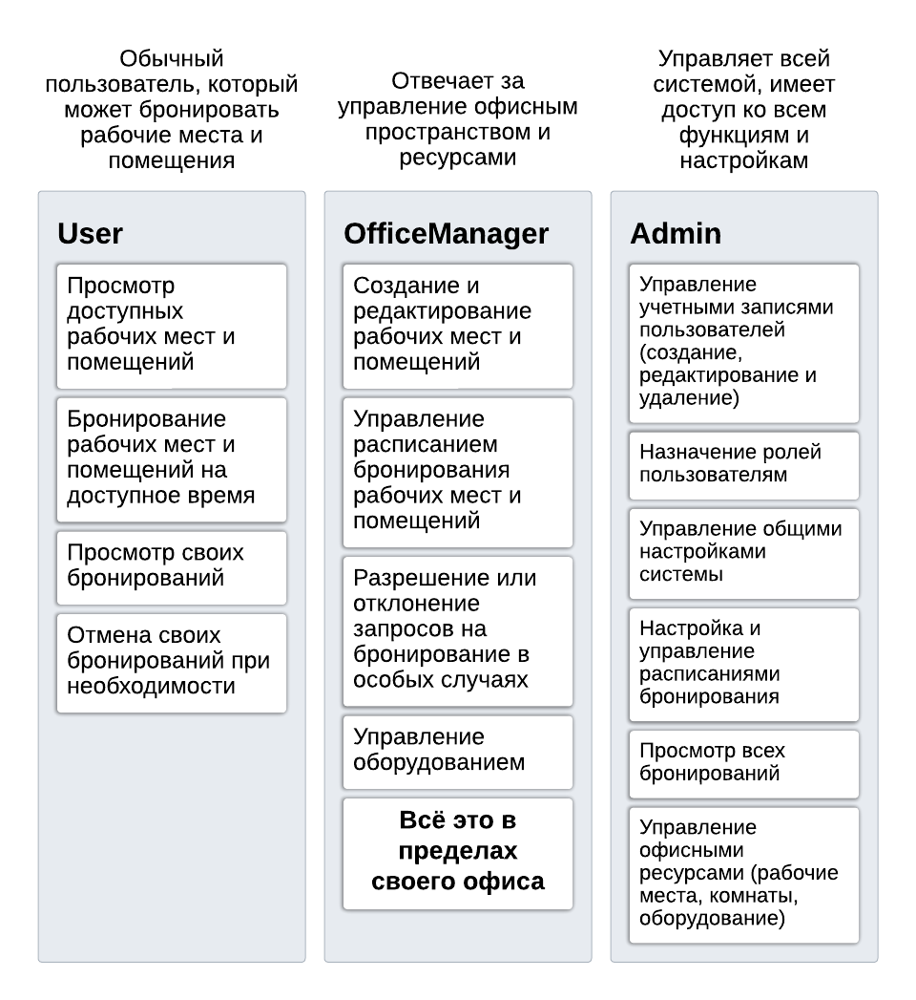

# evgeniy-yurov/workplace-reservation


## Getting Started

Download links:

SSH clone URL: ssh://git@git.jetbrains.space/rcmentorship/evgeniy-yurov/workplace-reservation.git

HTTPS clone URL: https://git.jetbrains.space/rcmentorship/evgeniy-yurov/workplace-reservation.git


These instructions will get you a copy of the project up and running on your local machine for development and testing purposes.

## Prerequisites

What things you need to install the software and how to install them.

```
Examples
```

## Deployment

Add additional notes about how to deploy this on a production system.

## Resources

Add links to external resources for this project, such as CI server, bug tracker, etc.

# Система бронирования рабочих мест
Данное приложение позволяет бронировать рабочие места в компании,
в которой нет закрепленных мест за каждым сотрудником. Пользователь может выбрать офис,
посмотреть список доступных мест, посмотреть детали конкретного места и 
забронировать его (если оно свободно). У пользователя есть профиль, где он
может посмотреть список своих бронирований, отменить бронирование, редактировать 
информацию о себе. Пользователи с ролью администратора могут смотреть список всех
бронирований и управлять информацией о местах и ролями пользователей.

## Ролевая модель
